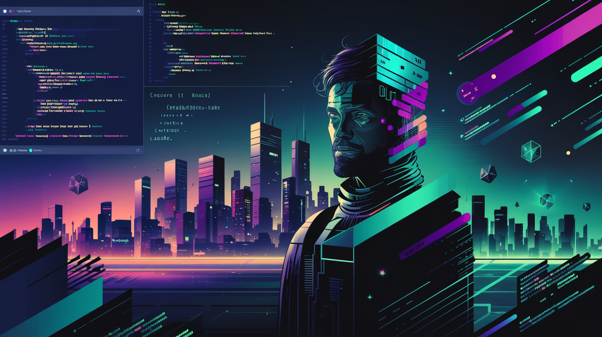

<!--
**Hsuyaa4518/Hsuyaa4518** is a ✨ _special_ ✨ repository because its `README.md` (this file) appears on your GitHub profile.

Here are some ideas to get you started:

- 🔭 I’m currently working on ...
- 🌱 I’m currently learning ...
- 👯 I’m looking to collaborate on ...
- 🤔 I’m looking for help with ...
- 💬 Ask me about ...
- 📫 How to reach me: ...
- 😄 Pronouns: ...
- ⚡ Fun fact: ...
-->

  

<h1 align="center">Hi 👋, I'm Ayush Pandey</h1>
<h3 align="center">A passionate Fullstack Developer and Blockchain Enthusiast</h3>

  
  
  

🌱 I’m currently building products on Blockchain

### About Me 📝

I'm a passionate Fullstack Developer with a keen interest in blockchain technology. My expertise lies in:

🔗 Building innovative DeFi (Decentralized Finance) products  
📚 Developing cutting-edge EdTech solutions on the blockchain  
💻 Creating robust and scalable fullstack applications  
💬 Ask me about Blockchain, Web Development, or DeF

### Languages and Tools 🛠️

  
  
  
  
  
  
  
  
  
  
  

### My GitHub Stats 📊

  

  

### Contribution Graph 🌟

  

### Connect with Me 🌐

- [LinkedIn](https://www.linkedin.com/in/ayush-pandey-32637823b/)
- [GitHub](https://github.com/Hsuyaa4518)
- [ X ](https://x.com/aayush_defi)

🎯 Future Goals

  -Contribute to open-source blockchain projects  
  -Speak at blockchain and web development conferences  
  -Launch a successful DeFi startup

### Fun Fact 🤓

I once drove a scooter at 70-80 kmph at night with a helmet that slipped over my eyes. I managed to handle the situation with calm and instinct, which gave me an adrenaline rush and a newfound confidence in handling tough situations!

<!--
**Hsuyaa4518/Hsuyaa4518** is a ✨ special ✨ repository because its `README.md` (this file) appears on your GitHub profile.

You can click the Preview link to take a look at your changes.
-->
